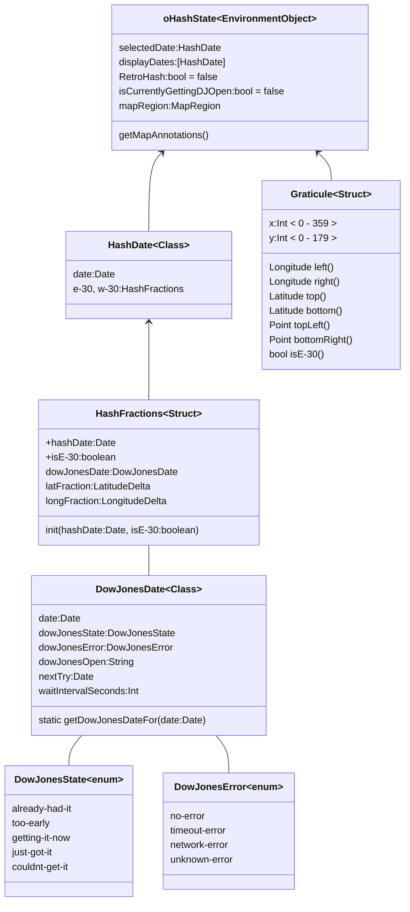

# Entity Relationship Diagram

Built with [MermaidJS](https://mermaid.js.org/)

```mermaid

classDiagram 

class oHashState~EnvironmentObject~{
    selectedDate:HashDate
    displayDates:[HashDate]
    RetroHash:bool = false
    isCurrentlyGettingDJOpen:bool = false
    mapRegion:MapRegion

    getMapAnnotations()
}

class HashDate~Class~{
    date:Date
    e-30, w-30:HashFractions
}
oHashState <-- HashDate

class HashFractions~Struct~{
    +hashDate:Date
    +isE-30:boolean
    dowJonesDate:DowJonesDate
    latFraction:LatitudeDelta
    longFraction:LongitudeDelta

    init(hashDate:Date, isE-30:boolean)
}
HashDate <-- HashFractions

class DowJonesDate~Class~{
    date:Date
    dowJonesState:DowJonesState
    dowJonesError:DowJonesError
    dowJonesOpen:String
    nextTry:Date
    waitIntervalSeconds:Int

    static getDowJonesDateFor(date:Date)
}
HashFractions -- DowJonesDate

class DowJonesState~enum~{
    already-had-it
    too-early
    getting-it-now
    just-got-it
    couldnt-get-it
}
DowJonesDate -- DowJonesState

class DowJonesError~enum~{
    no-error
    timeout-error
    network-error
    unknown-error
}
DowJonesDate -- DowJonesError

class Graticule~Struct~{
    x:Int < 0 - 359 >
    y:Int < 0 - 179 >

    Longitude left()
    Longitude right()
    Latitude top()
    Latitude bottom()
    Point topLeft()
    Point bottomRight()
    bool isE-30()
}
oHashState <-- Graticule

```
