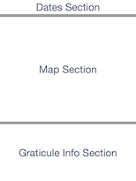

# UX Brainstorming

## Mockup Image

## Dates

- Default to 'today'
- Allow user to change to any other date if they want

## Map Section

### On Startup (if we have location permission)

- Calculate hashpoint for home grat
- Calculate hashpoints for 8 surrounding grats
- Zoom to show user location and closest hashpoint
- "Select" the grat with the closest hashpoint

### On Startup - First use (no location permission)

- Start zoomed out as far as possible
- Do not "Select" any grats
- Offer to auto-detect location

### On Startup - After first use (no location permission)

- App zooms / scrolls to where the user left it last time
- If user selected a grat last time, "Select" that grat again

### After Startup

- Display Map section as per 'Map Display' below
- User can scroll / zoom as they choose
- On scroll / zoom, display the new region on the Map
          as per 'Map Display' below
- App remembers where the user zoomed / scrolled to
- User can tap a grat to "Select" it
- App remembers if a user "Selects" a grat

## Map Display

### If zoomed out to most of the planet

- Just display gridlines every 10 x 10 grats
- Do not display gridlines for EVERY grat (yet)
- Do not display any grat info (yet)

### If zoomed in a little (but not much)

- Display primary gridlines every 10x10 grats
- Display secondary gridlines for every grat
- Do not display any grat info (yet)

### If zoomed in to just a handful of grats

- Display primary gridlines every 10x10 grats
- Display secondary gridlines for every grat
- Display grat info as per 'Graticule Display on Map' below

## Graticule Display on Map

### If we DO have the DJ Open

Calculate and dispay the hashpoint

### If we do NOT have the DJ Open

Display an icon to suggest why we have no DJ Open, eg:

- If it's before 9.30am (NY time), maybe a clock icon
- If it's after 9.30 and we're waiting on the network,
            maybe a spinner
- If it's after 9.30 and we've had an error, some error icon
- etc

## Graticule Info Section

### If no grat is selected

- Shrink down Grat Info section
- Display a message like "Click the map to select a box"

### If a grat is selected and we do NOT have its DJ Open

- Explain why we don't have the DJ Open
- Suggest when we are likely to have the DJ Open

### If a grat is selected and we DO have its DJ Open

- Calculate & display hashpoint deets
- Display buttons for Google Maps / Apple Maps / OSM / poster (any others?)

### If a grat is selected and we DO have its DJ Open but NOT the current location

- Offer to calc distance if user grants access to their location

### If a grat is selected and we DO have its DJ Open and ALSO the current location

- Calculate & display distance from current location
