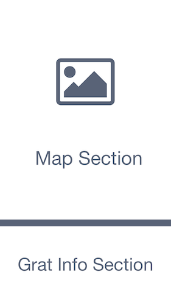

#  UX Brainstorming
This is version 2, which is the current version. 
See [version 1](ux_plan_01.md) for the previous version.

## Mockup Image

## On Startup

### If we have location permission

- Calculate the closest hashpoint (may or may not be in same grat as user location)
- Add that one hashpoint to the map
- Also display user location on the map 

### If we don't have location permission

- Default to zoomed all the way out, centre on 0,0

## Map Display

### If zoomed out a bit (or a lot)

- Message "Zoom in on the map, or use your location"
- Don't display any hashpoints

### If zoomed in to just a handful of grats

- Add all hashpoints in the viewable area to the map

## Hashpoint Display on Map

If we're zoomed in to just a handful of grats,
then every graticule that is visible
will be displayed as follows.

### If we DO have the DJ Open for that grat

- If we are looking at Today (or a date in the future),
        then do this,
        and do that
- If we are looking at a date in the past,
        then do this,
        and do that

### If we do NOT have the DJ Open for that grat

Display an icon to suggest why we have no DJ Open, eg:

- If it's before 9.30am (NY time), maybe a clock icon
- If it's after 9.30 and we're waiting on the network,
            maybe a spinner
- If it's after 9.30 and we've had an error, some error icon
- etc

### Icon / SFSymbol

- Today / Other Date
- Selected Hashpoint / Unselected

- Filled / Open
- Larger / Regular size
- Invert Colour?

## Hashpoint Info Section

### If no grat is selected

- asdfasdfasdf

### If a grat is selected and we do NOT have its DJ Open

- asdfasdfasdf

### If a grat is selected and we DO have its DJ Open

- asdfasdfasdf

### If a grat is selected and we DO have its DJ Open but NOT the current location

- asdfasdfasdf

### If a grat is selected and we DO have its DJ Open and ALSO the current location

- asdfasdfasdf

## Notifications

User can request a notification, whenever that day's closest hashpoint is
within a specified distance

User can request a notification, whenver that day's global hash is
within a (separately) specified distance

## Possible Future Additions

- Record a tracklog
- Create / populate wiki page
- Generate "proof" screen shot (or user could just take a regular screen shot...)
- Determine the best path to the hashpoint, 
using car / public transport / walking etc
